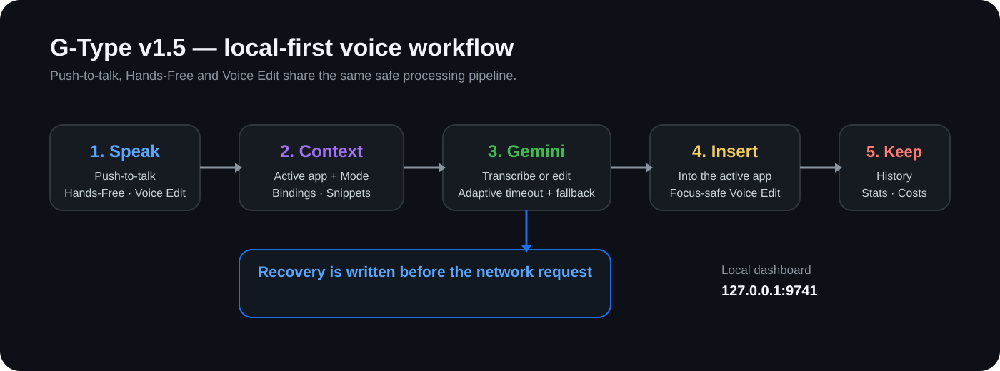

# G-Type

<p align="center">
  <strong>Google Gemini पर आधारित local-first, context-aware voice input.</strong>
</p>

<p align="center">
  <a href="https://github.com/IntelligenzaArtificiale/G-Type/releases/latest"></a>
  <a href="https://github.com/IntelligenzaArtificiale/G-Type/actions/workflows/ci.yml"></a>
  <a href="LICENSE"></a>
</p>

<p align="center">
  <a href="README.md">English</a> •
  <a href="README.it.md">Italiano</a> •
  <a href="README.es.md">Español</a> •
  <a href="README.pt-BR.md">Português (BR)</a> •
  <a href="README.hi.md"><b>हिन्दी</b></a>
</p>

> 🔄 `README.md` के साथ **G-Type v1.5.0** के लिए सिंक किया गया।

G-Type बैकग्राउंड में चलता है, केवल आपके बुलाने पर रिकॉर्ड करता है, आपकी अपनी Google Gemini API key का उपयोग करता है और परिणाम को सक्रिय ऐप में डालता है। **v1.5.0** में Context Awareness, Modes, app→Mode bindings, voice snippets, Hands-Free और Voice Edit जोड़े गए हैं, बिना किसी G-Type account, hosted backend या cloud database के।

<p align="center">
  
</p>

## Quick start

### 1. Install

Linux और macOS:

```bash
curl -fsSL https://raw.githubusercontent.com/IntelligenzaArtificiale/G-Type/main/install.sh | bash
```

Windows PowerShell:

```powershell
irm https://raw.githubusercontent.com/IntelligenzaArtificiale/G-Type/main/install.ps1 | iex
```

### 2. First-run setup

```text
http://127.0.0.1:9741/setup
```

अपनी Gemini API key जोड़ें, compatible model चुनें और शुरुआती push-to-talk hotkey सेट करें।

### 3. Dictation शुरू करें

```bash
g-type
```

Local dashboard:

```text
http://127.0.0.1:9741/
```

### 4. बाद में update करें

```bash
g-type upgrade
g-type version
```

## मुख्य सुविधाएँ

- **Global push-to-talk dictation** configurable hotkeys के साथ।
- **Context Awareness**: recording शुरू होते समय foreground app को best-effort तरीके से पहचानता है और समझ बेहतर करने के लिए context का उपयोग करता है।
- **Modes**: हर Mode की अपनी hotkey, Gemini model, timeout और optional instructions हो सकती हैं।
- **App → Mode bindings**: पहले से देखे गए app/context को किसी Mode से जोड़ा जा सकता है। किसी explicit non-default Mode hotkey की हमेशा प्राथमिकता रहती है।
- **Voice snippets**: बोले गए trigger को exact text, URL, email, number या signature में बदलें।
- **Backtrack**: “चार बजे, नहीं पाँच बजे” जैसी स्पष्ट spoken corrections में अंतिम corrected version रखता है।
- **Hands-Free**: एक बार दबाएँ तो recording शुरू, दूसरी बार दबाएँ तो बंद। Default: `Ctrl+Shift+H`।
- **Voice Edit**: text चुनें, edit hotkey दबाकर रखें, instruction बोलें और छोड़ें। Default: `Ctrl+Shift+E`।
- **Local history, statistics और cost tracking** app, Mode और operation metadata के साथ।
- **Recovery**: network request से पहले completed WAV local disk पर सुरक्षित हो जाता है, इसलिए Gemini/network failure पर audio नहीं खोता।
- **Gemini fallback** transient provider errors के लिए।
- **Background update checks** और rollback-safe self-update।
- **Optional startup at login** dashboard से।

## Compatibility

| Platform | Architecture |
|---|---|
| Linux | x86_64 |
| Windows | x86_64 |
| macOS | Intel x86_64 |
| macOS | Apple Silicon arm64 |

Context detection best-effort है। Linux पर G-Type X11/XWayland में उपलब्ध context information का उपयोग करता है; native Wayland compositor active app expose न करे तो G-Type context के बिना भी सामान्य रूप से काम करता रहता है।

Official binaries [GitHub Releases](https://github.com/IntelligenzaArtificiale/G-Type/releases) पर उपलब्ध हैं।

## रोज़मर्रा का उपयोग

Default controls:

```text
Ctrl+Shift+Space   Standard push-to-talk Mode
Ctrl+Shift+H       Hands-Free start / stop
Ctrl+Shift+E       Voice Edit — बोलते समय दबाकर रखें
```

सभी hotkeys dashboard से बदली जा सकती हैं। G-Type Mode, Hands-Free और Voice Edit hotkeys के बीच collisions को reject करता है।

अगर G-Type foreground में चल रहा है, तो `Ctrl+C` से रोकें और `g-type` से दोबारा शुरू करें।

## Modes और application bindings

UI में **Modes** पुराने Profiles/Templates distinction को replace करते हैं, जबकि configuration backward compatible रहती है।

एक Mode में हो सकता है:

- global hotkey;
- Gemini model;
- request timeout;
- custom instructions।

किसी app को Mode से जोड़ने के लिए:

1. App खोलें।
2. उसके अंदर कम से कम एक normal dictation करें।
3. **Settings → Applications** खोलें।
4. Observed context को किसी Mode से bind करें।

Resolution:

```text
Explicit non-default Mode hotkey → वही Mode हमेशा जीतता है
Default Mode / Hands-Free       → app binding हो तो उसका उपयोग
Binding न हो                    → default Mode
```

Mode चुनने के लिए कोई hidden AI classifier नहीं है।

## Voice snippets

**Settings → Snippets** में उदाहरण:

```text
Trigger: calendar link
Value:   https://example.com/calendar
```

Enabled snippets Gemini को context के रूप में दिए जाते हैं और जहाँ सुरक्षित हो वहाँ deterministic post-transcription replacement भी लागू किया जाता है। Limits: अधिकतम 100 snippets, trigger 100 characters तक और value 4,000 characters तक।

## Hands-Free

Hands-Free hotkey एक बार दबाकर recording शुरू करें और दूसरी बार दबाकर बंद करें। यह standard dictation वाली ही Recovery, fallback, history और cost tracking pipeline का उपयोग करता है।

## Voice Edit

1. Editable text चुनें।
2. Voice Edit hotkey दबाकर रखें।
3. Instruction बोलें, जैसे `इसे छोटा और professional बनाओ`।
4. Hotkey छोड़ें।

G-Type hotkey release होने के बाद selection capture करता है, selected text + spoken instruction को एक ही Gemini operation में भेजता है और result से selection replace करता है।

अगर final insertion से पहले focus किसी दूसरे app पर चला जाए, तो result History में रखा जाता है लेकिन गलत window में inject नहीं किया जाता।

## Recovery

हर network request से पहले G-Type temporary WAV और जरूरी metadata local disk पर रखता है। Gemini, network या post-processing failure होने पर item यहाँ उपलब्ध रहता है:

```text
http://127.0.0.1:9741/recovery
```

Recovery Mode, app context और operation type को सुरक्षित रखता है। Voice Edit के लिए selected source text भी रखा जाता है।

**अगर Recovery में जरूरी recordings हैं तो Recovery folder को manually delete न करें।**

## Dashboard

- **History** — recent transcriptions, search, app/context, Mode, operation, duration, model और cost।
- **Statistics** — usage, words, audio time, estimated time saved, models, tokens और costs।
- **Settings → General** — language, currency, microphone, default Mode, Hands-Free, Voice Edit, sounds और tray।
- **Settings → Modes** — Mode management और presets।
- **Settings → Applications** — observed contexts और bindings।
- **Settings → Snippets** — voice snippet editor।
- **Settings → API** — Gemini API key management।
- **Settings → System** — autostart, updates और runtime info।

## Updates

```bash
g-type upgrade
g-type version
```

अगर G-Type foreground में चल रहा हो: `Ctrl+C`, फिर `g-type upgrade`, `g-type version`, और उसके बाद `g-type`।

## Useful commands

```text
g-type                 G-Type शुरू करें
g-type setup           Web setup खोलें
g-type stats           Statistics और costs दिखाएँ
g-type upgrade         Latest release पर update करें
g-type version         Installed version दिखाएँ
g-type config          Configuration path दिखाएँ
g-type set-key <KEY>   Gemini API key बदलें
g-type test-audio      Microphone test करें
g-type list-devices    Input devices सूचीबद्ध करें
g-type help            CLI help दिखाएँ
```

## Data और privacy

- Dashboard केवल `127.0.0.1` पर bind होता है।
- Configuration, History और Recovery files local user directories में रहते हैं।
- Dashboard API Gemini API key को plain text में वापस नहीं करती।
- Audio transcription/editing के लिए configured Gemini API को भेजा जाता है।
- सुरक्षित रूप से उपलब्ध app context prompt में शामिल हो सकता है और local History में store हो सकता है।
- G-Type का अपना cloud account system या remote database नहीं है।

## Source से build करें

```bash
git clone https://github.com/IntelligenzaArtificiale/G-Type.git
cd G-Type
cargo build --release
```

Contribute करने से पहले:

```bash
cargo fmt --check
cargo clippy --all-targets --all-features -- -D warnings
cargo test --all-features
```

## Changelog और releases

- [CHANGELOG.md](CHANGELOG.md)
- [GitHub Releases](https://github.com/IntelligenzaArtificiale/G-Type/releases/latest)

## Screenshots

README अभी simulated UI screenshots के बजाय repository-native technical visual का उपयोग करता है। Dashboard screenshots वास्तविक running build से लिए जाने चाहिए और उनमें API keys, private history, emails, sensitive window titles या personal snippets नहीं होने चाहिए।

## License

MIT. [LICENSE](LICENSE) देखें।
